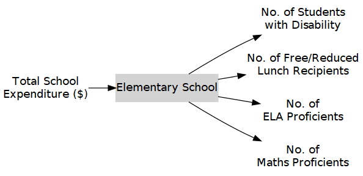
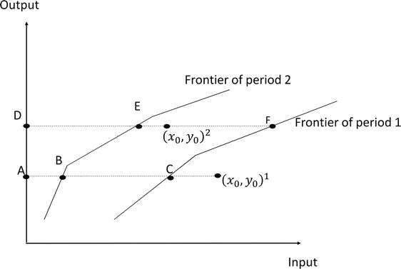
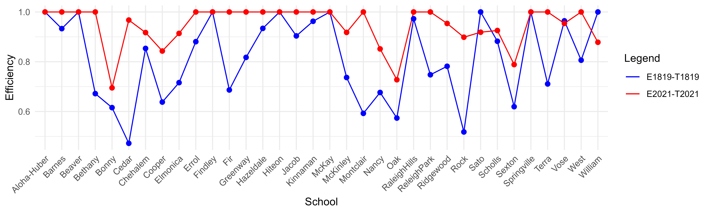
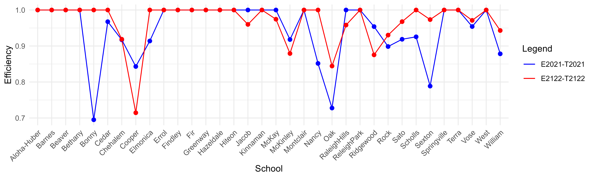

```{r child='TitleSheet.RMD'}
```


```{=tex}
\newpage
\pagenumbering{arabic}
```


```{r setup1, include=FALSE}
knitr::opts_chunk$set(echo = TRUE)
library(bibtex)
library (kableExtra)
suppressPackageStartupMessages(library(dplyr))


```

\begin{centering}

\Large

{\bf Abstract}

\end{centering}

We analyze the productivity changes of 34 elementary schools in Beaverton School District across the academic years 2018-19, 2020-21, and 2021-22. Utilizing the Malmquist productivity index as our methodological framework, we aim to estimate the changes in the total factor productivity which can be decomposed into two main components: pure technical efficiency change (PTEC) and technological change (TC). Our approach involves one input variable (total expenditure) and four output variables (number of disabled students, number of free/reduced meal recipients, number of ELA proficients, and number of Maths proficients). Utilizing these variables allow us to measure how effectively these schools are spending to achieve both equity and academic success. The findings indicate that, on average, the regression in total factor productivity from the academic year 2018-19 to 2020-21 is predominantly associated with technological change, while managerial efficiency exhibits a minimal impact on total factor productivity during this period. In contrast, the progression in total factor productivity from the academic year 2020-21 to 2021-22 is more closely linked to technological change, with managerial efficiency contributing minimally to the overall progress.

**Keywords:** *elementary school, pure technical efficiency change, technological change, total factor productivity, Malmquist productivity index, DEA*

\newpage

\tableofcontents

\newpage

\listoftables

\newpage

\listoffigures

\newpage

# Introduction  

Education, particularly within the context of elementary schools, occupies a pivotal role as a foundational building block for individual and societal development. The early years of education represent a critical phase in shaping young minds, imparting essential skills such as literacy, numeracy, and critical thinking. Beyond personal growth, education assumes profound significance for communities and nations, acting as a catalyst for social progress, economic advancement, and civic engagement. In this era of rapid globalization and technological advancement, the quality of elementary education assumes paramount importance, as it not only equips individuals with the tools to navigate the complexities of the modern world but also contributes to the overall vitality of a nation, which, in turn, is strongly associated with economic growth.

In the pursuit of educational excellence, the concept of benchmarking emerges as an integral strategy. Benchmarking schools allows for a systematic evaluation of their performance, enabling educational leaders to identify effective practices, areas for improvement, and innovative approaches. The utilization of Data Envelopment Analysis (DEA) as a benchmarking tool provides a rigorous framework for assessing the efficiency and effectiveness of elementary schools. DEA's inherent ability to accommodate multiple inputs and outputs without requiring predetermined weights makes it particularly well-suited for evaluating educational institutions [@fatimah2017].

## Quality Education Model (QEM)

Oregon's Quality Education Model is one such program which helps to identify best practices in delivering a quality K-12 education to all students and determine the resources needed to provide an optimal public education system. In doing so, it aims to rectify the disparities in educational resources and outcome, thereby fostering an equitable learning landscape. Through consistent updates and enhancements, the model incorporates contemporary best practices, empowering it to effectively assess and analyze education policy proposals in its biennial reports. This continuous improvement process is geared towards elevating the model into a research-oriented tool, providing valuable insights to educators and policymakers. By comprehensively understanding the level of investment required to achieve desired educational goals, this model facilitates informed decision-making, ultimately advancing the quality and fairness of education across the board [@qem2022]. 

Quality Education Model report from 2022 (13th edition) suggests that there are three major areas for best practices which can be listed as follows:

 - **Focus on equity centered practices**: Quality Education Commission believes focusing on equity is important to achieve lasting educational gains by promoting Oregon's most marginalized students namely students of color, first time English language learners, students with disabilities, and students from low-income families. The aim is to reduce disparities and improve equity. 
 
 - **Support student success**: Quality Education Model emphasizes on promoting student success by running a highly effective school system through various means such as implementing newest research, optimal use of technologies and so on.  
 
 - **Target investment where most needed**: Quality Education Model suggests to target uses of resources such that it incorporates a focus on equity and increased support for traditionally marginalized students.   
 
Quality Education Model is a "professional judgment model" that proposes a set of hypothetical prototype schools. These schools serve as the unit of analysis for evaluating costs. In other words, each hypothetical school helps to estimate how much would it cost to run a highly effective school system using a set of inputs required. Since we will be focusing primarily on elementary schools, a prototype elementary school defined by the Quality Education Model has the following attributes [@qem2022]:

**Elementary School- 360 Students**

- All-day kindergarten
- Class size average: 20
- 1 librarian per school
- 1 school nurse per school
- 1 PE and music specialist per school
- 1 Family Resource Staffer per school
- Computers for students and staff

## Beaverton School District 

The Beaverton School District is a prominent educational institution known for its commitment to providing quality education to students in the Beaverton area. It serves as a hub for diverse communities, catering to a wide range of student needs and aspirations. With a strong emphasis on academic excellence and holistic development, the district strives to prepare students for lifelong success. It caters to students from various areas, including Beaverton, Hillsboro, Aloha, and unincorporated neighborhoods of Portland. The district has a rich history, with its roots dating back to 1876 when the Beaverton Elementary School District 48 was established. Over time, it merged with other elementary districts and eventually unified with the Beaverton High School District to create the current unified school district. With an enrollment of approximately 39,180 students as of 2022, the Beaverton School District is the third-largest school district in the state. It operates a total of 34 elementary schools, 9 middle schools, and 6 high schools, including the newest addition, Mountainside High School, which opened in 2017. 

The Beaverton School District has made significant strides in managing resources effectively to support student achievement. It employs over 2,100 teachers and approximately 4,458 staff members to provide quality education. With a budget of $622.8 million for the 2022-2023 school year, the district continues to invest in various educational initiatives to enhance learning experiences for its diverse student population. The Beaverton School District is committed to meeting the diverse needs of its students, providing equitable education, and ensuring their success in their academic journey. Through ongoing efforts and strategic planning, the district aims to continue its mission of delivering high-quality education and preparing students for lifelong success [@Wiki_2023].

In conjunction with the Quality Education Model's efforts to explore optimal approaches in Oregon's public education landscape, our study has chosen to focus on Beaverton School District and its elementary schools as the subject of our efficiency analysis through DEA.

## Impact of COVID Pandemic in Elementary Schools 

The COVID-19 pandemic brought about profound disruptions in elementary education, prompting a transition from traditional in-person classrooms to online learning. This shift, though crucial for continuity, brought disparities in technology access, particularly affecting lower-income students with limited internet connectivity at home [@Coe]. The impact on elementary school education, however, extends beyond access challenges. The pandemic-induced closures and the subsequent shift to virtual learning led to a decline in learning progress, especially affecting younger students' skill development and cognitive growth. This decline, exemplified by a notable drop in Maths scores, poses challenges for elementary school students, necessitating targeted remediation policies to address the widening educational inequalities [@Richmond].

The repercussions of the pandemic on elementary education are multifaceted, encompassing not only academic setbacks but also concerning trends in students' mental health. It highlights a significant rise in anxiety and depression among elementary students, emphasizing the need for comprehensive support measures [@Prothero22]. Furthermore, data reveals persistent academic gaps among elementary students, with the interruption of in-person learning creating a compounding effect that requires substantial intervention for recovery. Efforts, including federal funding for interventions like tutoring and summer school, have not yet bridged the gap, underscoring the ongoing challenges in aligning the scale of unfinished learning [@Schwartz23]. These findings collectively emphasize the urgent need for targeted strategies, including increased technology access, mental health support, and tailored academic recovery programs, to address the diverse challenges faced by elementary students in the wake of the COVID-19 pandemic.

## Scope and Objective of Study 

This study aims to assess the efficiency change of elementary schools in Beaverton School District using DEA-based Malmquist productivity index analysis. The primary focus lies on assessing efficiency changes across three pivotal academic years: 2018-19 (pre-COVID pandemic), 2020-21 (first period of COVID pandemic) and 2021-22 (second period of COVID pandemic). The objective is to quantify and analyze the efficiency shifts within these time-frames and understand the impact of COVID-19 pandemic on elementary school performance in the district. This will also enable us to better understand how elementary schools adapted and handled the challenges brought by the pandemic.

The rest of this report is organized as follows. Section \ref{litreview} presents a literature review on benchmarking tools and use of Malmquist productivity index analysis in education. Section \ref{data} outlines the data source, data processing and selection of input, and output variables. Section \ref{methodology} presents input oriented VRS DEA model and Malmquist productivity index used for efficiency analysis. Section \ref{results} delves into the interpretation and discussion of the results obtained. Section \ref{conclusion} provides concluding remarks and Section \ref{limitations} discusses the limitations of this study and suggests possible areas for future work. Finally, Section \ref{appendix} provides efficiency results in Appendix using several benchmarking packages. 

# Literature Review {#litreview}

<!--In the pursuit of continuous improvement, organizational assessments are centered around measuring the efficiency of educational programs in achieving the institution's stated goals [@alam2023]. For elementary schools, periodic performance evaluations are crucial for optimizing resource utilization. By comparing performance with peer institutions using relative efficiency measurements, schools can identify areas for improvement, set growth benchmarks, make informed decisions, and enhance overall performance.-->

## Methods of Evaluation  

Efficiency estimation in various fields often relies on two distinct methods: the parametric Stochastic Frontier Analysis (SFA) and the non-parametric Data Envelopment Analysis (DEA). SFA takes a different route. It employs a stochastic procedure, meaning it accounts for uncertainty in its evaluations. This makes SFA well-suited for cases where data might have inherent variability or randomness [@alam2023]. However, SFA introduces complexity, especially when dealing with scenarios that involve multiple inputs and outputs. The interplay of these various factors can challenge the precise determination of efficiency scores, necessitating careful consideration of model assumptions and data characteristics [@alam2023].

On the other hand, DEA takes a deterministic approach, systematically enveloping observations within a predetermined framework to quantify efficiency levels [@alam2023]. By doing so, it offers valuable insights into how effectively tasks are being accomplished and identifies potential benchmarks for improvement. This method proves particularly useful in situations where a direct comparison of inputs and outputs is needed with minimal assumptions and without explicit information on either inputs or outputs[@alam2023] [@theodoridis2011] [@munoz2016]. DEA was initially introduced by Charnes, Cooper & Rhodes [@charnes1978] as the CCR model which assumes Constant Return to Scale (CRS) and later extended by Banker, Charnes & Cooper (1984) as the BCC model  which employs Variable Returns to Scale (VRS) [@nayame2019]. CRS scale means that changes in inputs have a proportional impact on outputs whereas VRS scale assumes that changes in inputs do not have a proportional impact on outputs. As a non-parametric linear programming method, DEA enables the comparison of efficiencies among various units under evaluation, termed as Decision Making Units (DMUs). The performance of these DMUs is evaluated based on the concept of efficiency and productivity, represented as the ratio of total outputs to total inputs. Efficiency scores are estimated in relation to the top-performing DMU (or DMUs), which receives a score of 1, while other DMUs' performance falls between 0 and 1 relative to this best performance. Thus by providing frontier locations, DEA helps to identify benchmarks for inefficient units while offering areas for improvement to enhance overall efficiency [@alam2023] [@tyagi2009].

## Malmquist Productivity Index Analysis in Education 

The Malmquist productivity index has been a pivotal tool in evaluating educational efficiency, technology change, and overall productivity across diverse contexts. Rahimian et al. studied on Iranian universities spanning the years 2004 to 2007, employing a combination of DEA and the Malmquist productivity index. Their approach considered three inputs- number of students, university professors, and employees- and two outputs- number of educated individuals and research outputs. The results show a notable opportunity for improvement among several private educational institutions, emphasizing these institutions to focus on enhancing their research activities and increase performance levels, particularly through emphasis on publications [@rahimian13]. Similarly, in their study, Wang et al. highlighted the pivotal role of universities in national development, particularly addressing challenges encountered by the top 8 institutions in New Zealand. Despite their global acclaim, declining rankings are attributed to government funding policies leading to insufficient resources. Through the application of the Malmquist productivity index model, the research analyses technical efficiency, technological change, and overall productivity from 2013 to 2018. The results reveal a "no-change" scenario, prompting universities to enhance internal factors and adapt to technological advancements for sustainable progress [@wang20].

Pietrzak et al. studied to determine changes in efficiency of humanities faculties using Malmquist productivity index across 14 universities. The study utilized output-oriented Malmquist productivity index for 2008-09 to 2014-15. The results show an average total factor productivity value of 28%, indicating increased faculty productivity. The technological growth exhibited minimal influence on the index, maintaining an average value of around 1. The primary driving factor for increased productivity of faculties was identified as changes in technical efficiency [@pietrzak17]. Zhang et al. proposed a DEA approach to evaluate the performance of higher education resource utilization in provincial level in China. To assess the productivity change of each province, Malmquist productivity index was used for period 2005 to 2015. Results show that higher education in China experienced overall gains in productivity, primarily driven by technological advancements, with policy recommendations emphasizing the need for balanced development and improved resource utilization, especially in less developed provinces [@zhang20].

Afonso et al. analyzed the productivity changes in basic and secondary education for 24 governorates in Tunisia over the period 2004 to 2008 using Malmquist productivity index to estimate the changes in total factor productivity. The study used four input variables- teacher-to-student ratio, classes-to-student ratio, schools-to-inhabitants ratio, and education expenditure per student- and two output variables that measure success rate of baccalaurate exam and rate of non-doubling in the 9th year. The results show that on average, changes in total factor productivity growth during the period 2004-2008 linked more to the changes in technology, while the impact of managerial efficiency on total factor productivity was insignificant [@afonso13]. Mostoli et al. studied on 120 ninth grade female students using Malmquist productivity index at different time intervals to evaluate the development of the educational process in increasing mathematical literacy. The initial use of the output-oriented CCR model allowed for the determination of students' performance coefficients, followed by the application of the Malmquist productivity index to compare productivity evaluations at two distinct points: end of the training course in December and the end of the year in June. The results show that students in the experimental group, exposed to problem-solving and realistic mathematics, demonstrated an increased overall productivity evaluation factor after completing the training compared to the others [@mostoli19]. 

# Data {#data}

## Data Processing

The data used in this study was extracted from the official website of the Oregon Department of Education [(\textcolor{blue}{\text{ODE}})](https://www.oregon.gov/ode) for three academic years 2018-19, 2020-21, and 2021-22 for 34 elementary schools in Beaverton School District. The study excluded the academic year 2019-20 due to unavailability of data. Additionally, there were some missing data for ELA and Maths proficiency in the academic year 2020-21. To address this, we calculated average percentage drop for ELA and Maths proficients from academic year 2018-19 to 2020-21. On average, ELA proficients experienced a decline of approximately 90%, while Maths proficients dropped by around 89%. This observed trend guided our approach to fill in the missing proficiency data for the academic year 2020-21. To ensure data accuracy and reliability, a series of data pre-processing and cleaning steps were undertaken. Essential R library packages, including `dplyr`, `stringr`, and `readr`, were employed for this purpose. The GitHub repository containing all the data processing files can be accessed at [\textcolor{blue}{\text{Kamaljthapa}}](https://github.com/Kamaljthapa/Beaverton-School-District-DEA).

The data for academic year 2018-19 is presented in Table \ref{tab:data1819}

```{r bsd_school_data, echo = FALSE}
library(readr)
library(dplyr)
library(stringr)
library(kableExtra)
library(TRA)

schooldata <- read_csv("D:/PSU/DEA/BSD DEA Project/ETM 506/MPI Project/Processed Data/MPI_BDS_data.csv", show_col_types=F)

rdatall <- as.data.frame(schooldata[,1:7]) |>
  mutate(School = substr(School, 1, nchar(School)-4))

colnames(rdatall) <- linebreak(c("School Name", "Total\n Student","Total\n Expenditure",
                                "No. of Students\n with Disability",
                                "No. of Free/Reduced\n Lunch Recipeients",
                                "No. of ELA\n Proficients",
                                "No. of Maths\n Proficients"))

```

```{r data1819, echo = FALSE}

data1819 <- rdatall[1:34,]

data1819_stat <- schooldata[1:34,c(1,2,3,4,5,8,9)] #to eliminate Columns with Asterisk

data1819_mean <- matrix(round(colMeans(data1819_stat[,-1])), ncol=6, byrow=TRUE)
data1819_sd   <- matrix(round(apply(data1819_stat[, -1], 2, sd)) , ncol=6, byrow=TRUE)
data1819_max  <- matrix(round(apply(data1819_stat[, -1], 2, max)) , ncol=6, byrow=TRUE)
data1819_min  <- matrix(round(apply(data1819_stat[, -1], 2, min)) , ncol=6, byrow=TRUE)

data1819_mean_fin <- c("Mean", data1819_mean)
data1819_sd_fin   <- c("Std. Dev.",data1819_sd)
data1819_max_fin  <- c("Max. Value", data1819_max)
data1819_min_fin  <- c("Min. Value", data1819_min)

data1819_comb <- rbind(data1819, data1819_mean_fin, data1819_sd_fin, data1819_max_fin, data1819_min_fin) 

#  convert columns 2 to 7 to numeric
for (i in 2:7) {
  data1819_comb[, i] <- as.numeric(data1819_comb[, i])
}

kable(data1819_comb, booktabs = T, align = "lcccccc", digits = 3, escape=F,
      caption = "Data for Academic Year 2018-19") |>
  row_spec(nrow(data1819_comb)-4, extra_latex_after = c("\\hline","\\rowcolor{white}")) |>
  row_spec(nrow(data1819_comb)-3, bold = T) |>
  row_spec(nrow(data1819_comb)-2, bold = T) |>
  row_spec(nrow(data1819_comb)-1, bold = T) |>
  row_spec(nrow(data1819_comb),   bold = T) |>
  kable_styling(latex_options = c("HOLD_position","striped","repeat_header","scale_down"))
```


The data for academic year 2020-21 is presented in Table \ref{tab:data2021}.

```{r data2021, echo = FALSE}

data2021 <- rdatall[35:68,]
data2021_stat <- schooldata[35:68,c(1,2,3,4,5,8,9)] #to eliminate Columns with Asterisk

data2021_mean <- matrix(round(colMeans(data2021_stat[,-1])), ncol=6, byrow=TRUE)
data2021_sd   <- matrix(round(apply(data2021_stat[, -1], 2, sd)) , ncol=6, byrow=TRUE)
data2021_max  <- matrix(round(apply(data2021_stat[, -1], 2, max)) , ncol=6, byrow=TRUE)
data2021_min  <- matrix(round(apply(data2021_stat[, -1], 2, min)) , ncol=6, byrow=TRUE)

data2021_mean_fin <- c("Mean", data2021_mean)
data2021_sd_fin   <- c("Std. Dev.",data2021_sd)
data2021_max_fin  <- c("Max. Value", data2021_max)
data2021_min_fin  <- c("Min. Value", data2021_min)

rownames(data2021) <- NULL

data2021_comb <- rbind(data2021, data2021_mean_fin, data2021_sd_fin, data2021_max_fin, data2021_min_fin) 

#  convert columns 2 to 5 to numeric
for (i in 2:5) {
  data2021_comb[, i] <- as.numeric(data2021_comb[, i])
}

kable(data2021_comb, booktabs = T, align = "lcccccc", digits = 3, escape=F,
      caption = "Data for Academic Year 2020-21") |>
  row_spec(nrow(data2021_comb)-4, extra_latex_after = c("\\hline","\\rowcolor{white}")) |>
  row_spec(nrow(data2021_comb)-3, bold = T) |>
  row_spec(nrow(data2021_comb)-2, bold = T) |>
  row_spec(nrow(data2021_comb)-1, bold = T) |>
  row_spec(nrow(data2021_comb),   bold = T) |>
  kable_styling(latex_options = c("HOLD_position","striped","repeat_header","scale_down")) |>
  footnote(symbol = c("Calculated based on average percentage change from academic year 2018-19 to 2020-21"))

```

The data for academic year 2021-22 is presented in Table \ref{tab:data2122}.

```{r data2122, echo = FALSE}

data2122 <- rdatall[69:102,]
data2122_stat <- schooldata[69:102,c(1,2,3,4,5,8,9)] #to eliminate Columns with Asterisk

data2122_mean <- matrix(round(colMeans(data2122_stat[,-1])), ncol=6, byrow=TRUE)
data2122_sd   <- matrix(round(apply(data2122_stat[, -1], 2, sd)) , ncol=6, byrow=TRUE)
data2122_max  <- matrix(round(apply(data2122_stat[, -1], 2, max)) , ncol=6, byrow=TRUE)
data2122_min  <- matrix(round(apply(data2122_stat[, -1], 2, min)) , ncol=6, byrow=TRUE)

data2122_mean_fin <- c("Mean", data2122_mean)
data2122_sd_fin   <- c("Std. Dev.",data2122_sd)
data2122_max_fin  <- c("Max. Value", data2122_max)
data2122_min_fin  <- c("Min. Value", data2122_min)

rownames(data2122) <- NULL

data2122_comb <- rbind(data2122, data2122_mean_fin, data2122_sd_fin, data2122_max_fin, data2122_min_fin) 

#  convert columns 2 to 5 to numeric
for (i in 2:7) {
  data2122_comb[, i] <- as.numeric(data2122_comb[, i])
}

kable(data2122_comb, booktabs = T, align = "lcccccc", digits = 3, escape=F,
      caption = "Data for Academic Year 2021-22") |>
  row_spec(nrow(data2122_comb)-4, extra_latex_after = c("\\hline","\\rowcolor{white}")) |>
  row_spec(nrow(data2122_comb)-3, bold = T) |>
  row_spec(nrow(data2122_comb)-2, bold = T) |>
  row_spec(nrow(data2122_comb)-1, bold = T) |>
  row_spec(nrow(data2122_comb),   bold = T) |>
  kable_styling(latex_options = c("HOLD_position","striped","repeat_header","scale_down")) 

```


## Selection of Inputs and Outputs 

The criteria for selection of inputs and outputs are subjective and lack specific guidelines for this process [@tyagi2009]. Typically, inputs encompass the resources or factors employed by DMUs to generate outputs, while outputs signify the outcomes or results produced by the DMUs using these inputs. DEA studies commonly employ "lesser-the-better" measures for inputs, indicating that lower values correspond to heightened efficiency. Conversely, "more-the-better" measures are used for outputs, with higher values signifying enhanced performance [@cook2014]. This approach enables DEA to evaluate DMU efficiency by minimizing inputs or maximizing outputs.

Generally inputs and outputs are chosen based on the objective of the study. In our study, we seek to assess the overall performance of elementary schools in Beaverton School District, considering the challenge of budget constraints while prioritizing processes that support student success and equitable practices in elementary schools. Therefore, we chose the following inputs and outputs that aligns with the three key focus areas- expenditure, equity, and performance as outlined by Quality Education Model. 

### Input 

- **Total school expenditure**: It refers to the overall amount of money spent on various aspects of operation and educational programs. This expenditure covers resources, personnel, facilities, and services aimed at providing education and support to students and faculties in categories such as *Direct Classroom Expenditures*, *Classroom Support*, *Building Support*, *Central Support*, and *Other Expenditures*. 

### Outputs 

- **Number of students with disability**: This represents the number of students who had an Individualized Education Program at any time during that school year. It indicates the school's commitment to inclusivity and providing individualized support for diverse learners. 

- **Number of free/discounted lunch recipients**: This indicates the number of students eligible for free or discounted lunch under the National School Lunch Program at any time during that school year. This information is used as an indicator of the school's socio-economic diversity and the proportion of students from low-income families.

- **Number of ELA proficients**: This refers to the number of students proficient in English, language and arts. Students are proficient when they attain a level of English language skill necessary to independently produce, interpret, collaborate on, and succeed on grade-level content-related academic tasks in English. This is indicated on *ELPA21* by attaining a profile of Level 4 or higher in all domains. It signifies a school's focus on language development, academic preparedness, support for English language learners, effective teaching, and readiness for future success.

- **Number of Maths proficients**: This reflects the number of students proficient in Mathematics. Students are proficient when they can apply math skills and knowledge to real world contexts and to problem-solving. It quantifies the student performances and reflects their mastery of mathematical concepts in a school.

Thus, based on QEM, above output variables can be categorized into two groups:  

**Equity Centered Measures**- Number of students with disability and number of free/discounted lunch recipients

**Performance Based Measures**- Number of ELA proficients and number of Maths proficients 

Figure \ref{fig:dgm_viusalize} shows the DEA model used for this study.


```{r dgm_viusalize, echo=FALSE, out.width="50%", fig.show='hold',fig.align='center', fig.cap="DEA Input-Output Diagram (BSD)", message=FALSE}

library (devtools, quietly = TRUE)
library (TRA, quietly = TRUE)

library(DiagrammeR, quietly = TRUE)
library(DiagrammeRsvg, quietly = TRUE)
library(svglite, quietly = TRUE)
library(rsvg, quietly = TRUE)
library(png, quietly = TRUE)

xnames_printable<-c("Total School \nExpenditure ($)")
ynames_printable<-c("No. of Students \nwith Disability",
                    "No. of Free/Reduced \nLunch Recipients", 
                    "No. of \nELA Proficients", 
                    "No. of \nMaths Proficients")

Figure <- DrawIOdiagram (xnames_printable,ynames_printable,'"Elementary School"')

tmp <- capture.output(rsvg_png(charToRaw(export_svg(Figure)),'img/school_rank.PNG'))

```

# Methodology {#methodology}

## DEA model

DEA analysis needs to clearly identify what is to be achieved from the analysis and based on that DEA models can typically adopt two main forms: input-oriented or output-oriented [@cook2014]. Input orientation, also known as input minimization or contraction, aims to minimize inputs while still achieving the given output levels. On the other hand, output orientation, also known as output maximization or expansion, seeks to maximize outputs without requiring any increase in observed input values. When dealing with inflexible inputs not fully under control, an output-based approach would be more suitable. However, in cases where outputs are determined by management goals rather than maximizing performance, an input-based approach may be more appropriate [@tyagi2009].
 
Another option in DEA analysis is the choice between constant returns to scale (CRS) and variable returns to scale (VRS). The concern about returns to scale revolves around how schools' outputs are affected when they alter the quantity of inputs used in their production process [@badri2014]. CRS assumes no significant relationship between the scale of operations and school efficiency, meaning large schools can be just as efficient as small ones in converting inputs to outputs. The efficiency score under CRS corresponds to technical efficiency (TE) which measures efficiency due to input and output configuration as well as the scale of operation. In contrast, VRS implies that an increase in input would lead to a disproportionate increase in output. VRS is preferred when there is a significant correlation between the size of DMUs and efficiency in a large sample [@tyagi2009]. The efficiency score under VRS corresponds to pure technical efficiency (PTE) which is a measure of efficiency without the scale efficiency. For our study, there are schools of varying operational sizes. As a result, we have chosen a VRS scale assuming there may be a significant relationship between the scale of operation and school efficiency. 

Based on Quality Education Model report [@qem2022], elementary schools in Beaverton School District aim to minimize the total school expenditure (because of budget constraint) while promoting school performance, equity centered practices and fulfillment of socio-economic needs. Since the input variable, *total school expenditure*, can be adjusted and controlled to a certain extent, this study uses input orientation VRS DEA model for efficiency assessment. 

The input-oriented VRS envelopment model for calculating efficiency can be formulated as the following linear programming problem:

$$
\begin{split}
\begin{aligned}
    \text{minimize  }   & \theta \\
    \text{subject to } & \sum_{j=1}^{n} x_{i,j}\lambda_j \leq \theta x_{i,k} \; \forall \; i\\
                       & \sum_{j=1}^{n} y_{r,j}\lambda_j \geq y_{r,k} \; \forall \; r\\
                       & \sum_{j=1}^{n} \lambda_j  = 1\\
                       & \lambda_j \geq 0  \; \forall  \; j
  \end{aligned}
 \end{split}
$$

## Malmquist Productivity Index (MPI)

The Malmquist productivity index (MPI) captures the progress or regress in the efficiency of a DMU and the progress or regress of frontier technology over time. Initially introduced by Malmquist in 1953 as a measure of standard of living, it was subsequently applied to production theory in 1982 by Christensen and Diewert [@caves82]. In 1989, Farr et al., utilized DEA to calculate the Malmquist index, and by 1994, the index was broken down into two factors: efficiency and technology. This technical efficiency values obtained from DEA equations are computed as a distance function [@mostoli19]. This DEA-based MPI measures the total factor productivity by handling multiple inputs and outputs with minimal assumptions and without explicit information on either inputs or outputs.

To illustrate the MPI, Figure \ref{fig:MIdigram} depicts a DMU at period 1 and period 2. Calculating the MPI for a specific DMU involves computing the geometric mean of two ratios. These ratios are derived from the efficiencies of the DMU at period 1 and 2 for both frontiers. 

```{r MIdigram, echo=F, out.width="90%", fig.align='center', fig.cap="Vectors of Inputs and Outputs in Different Periods"}

```

MPI can be explained by decomposing it into two factors- Catch-up effect pertaining to efficiency change and Frontier-shift effect associated with technological change. 

### Catch-up Effect

The catch-up effect from period 1 to 2 is measured as:

$$
\begin{split}
\begin{aligned}
    & \text{Catch-up} = \frac{\text{Efficiency}\, \text{of }(x_0,y_0)^{2} \text{ with respect to period 2 frontier}}
                        {\text{Efficiency}\, \text{of }(x_0,y_0)^{1} \text{ with respect to period 1 frontier}} \\
    &\text{Catch-up} = \frac{\text{DE/D}{x_0}^2} {\text{AC/A}{x_0}^1} &\text[Eq-1] \\ 
\end{aligned}
\end{split}
$$


In Figure \ref{fig:MIdigram}, DE represents the distance between points D and E, while D$x_0$$^2$ symbolizes the distance between D and the abscissa of the point ($x_0$, $y_0$)$^2$. Similarly, AC signifies the distance between points A and C, and and A$x_0$$^1$ is the distance between A and abscissa of the point ($x_0$, $y_0$)$^1$.


(Catch-up) > 1 indicates progress in relative efficiency from period 1 to 2 while (Catch-up) = 1 and (Catch-up) < 1 indicate no change and regress in efficiency respectively.

### Frontier-shift Effect

The change of ($x_0$, $y_0$)$^1$ from frontier of period 1 to frontier of period 2 is called the Frontier-shift effect at ($x_0$, $y_0$)$^1$ and it can be evaluated as:

$$
\begin{split}
\begin{aligned}
    & \text{F1} = \frac{\text{AC}} 
                  {\text{AB}}  &\text[Eq-2]
\end{aligned}
\end{split}
$$

If numerator and denominator are divided by the distance between A and abscissa of point ($x_0$, $y_0$)$^1$ in Eq-2, then:

$$
\begin{split}
\begin{aligned}
    & \text{F1} = \frac{\text{AC/A}{x_0}^1} {\text{AB/A}{x_0}^1} &\text[Eq-3]\\
    & \text{F1} = \frac{\text{Efficiency}\, \text{of }(x_0,y_0)^{1} \text{ with respect to period 1 frontier}}
                        {\text{Efficiency}\, \text{of }(x_0,y_0)^{1} \text{ with respect to period 2 frontier}} &\text[Eq-4] \\ 
\end{aligned}
\end{split}
$$

The change of ($x_0$, $y_0$)$^2$ from frontier of period 1 to frontier of period 2 is called the Frontier-shift effect at ($x_0$, $y_0$)$^2$ and it can be expressed as:


$$
\begin{split}
\begin{aligned}
    & \text{F2} = \frac{\text{DF}} 
                  {\text{DE}} &\text[Eq-5] 
\end{aligned}
\end{split}
$$

$$
\begin{split}
\begin{aligned}
    & \text{F2} = \frac{\text{DF/D}{x_0}^2} {\text{DE/D}{x_0}^2} &\text[Eq-6]\\
    & \text{F2} = \frac{\text{Efficiency}\, \text{of }(x_0,y_0)^{2} \text{ with respect to period 1 frontier}}
                        {\text{Efficiency}\, \text{of }(x_0,y_0)^{2} \text{ with respect to period 2 frontier}} &\text[Eq-7]\\ 
\end{aligned}
\end{split}
$$
 Using F1 and F2, the Frontier-shift effect can be defined as the geometric mean as follows:
 
 
 
 $$
\begin{split}
\begin{aligned}
    & \text{Frontier-shift} = \sqrt{\text{F1}\cdot\text{F2}} &\text[Eq-8] 
\end{aligned}
\end{split}
$$

A value of (Frontier-shift) > 1 signifies progress in the frontier technology around DMU from period 1 to 2. Conversely, (Frontier-shift) = 1 and (Frontier-shift) < 1 indicate the status-quo and regress in the frontier technology respectively.

### Malmquist Productivity Index (MPI)

The Malmquist productivity index (MPI) is computed as the product of Catch-up and Frontier shift terms as:

$$
\begin{split}
\begin{aligned}
    & \text{MPI} = \text{Catch-up}\cdot \text{Frontier-shift} &\text[Eq-9]
\end{aligned}
\end{split}
$$

Using Eq-1, 2, 5, and 8, Eq-9 can be re-written as:
$$
\begin{split}
\begin{aligned}
    & \text{MPI} = \frac{\text{A}{x_0}^1} 
                  {\text{D}{x_0}^2} \sqrt\frac{\text{DF}\cdot \text{DE}} 
                  {\text{AC}\cdot \text{AB}} &\text[Eq-10]
\end{aligned}
\end{split}
$$

In Eq-10, first term signifies the relative change in performance, while the second represents the relative change in frontier used to evaluate these performances.

Eq-1 can also be expressed using notation for efficiency score of DMU as follows:

$$
\begin{split}
\begin{aligned}
    & \text{Catch-up} = \frac{{\delta}^2 \text((x_0,y_0)^{2})} 
                  {{\delta}^1 \text((x_0,y_0)^{1})}  &\text[Eq-11]
\end{aligned}
\end{split}
$$

In Eq-11, $\delta$$^2$(($x_0$, $y_0$)$^2$) denotes the efficiency of DMU observed in period 2 measured by the frontier technology 2 and $\delta$$^1$(($x_0$, $y_0$)$^1$) denotes the efficiency of DMU observed in period 1 measured by the frontier technology 1. $\delta$$^1$ refers to the frontier efficiency of period 1 and $\delta$$^2$ refers to frontier efficiency of period 2. 

Likewise, the Frontier-shift and can be re-written as:


$$
\begin{split}
\begin{aligned}
    & \text{Frontier-shift} = \sqrt{\frac{{\delta}^1 \text((x_0,y_0)^{1})} 
                  {{\delta}^2 \text((x_0,y_0)^{1})} \cdot 
                  \frac{{\delta}^1 \text((x_0,y_0)^{2})} 
                  {{\delta}^2 \text((x_0,y_0)^{2})}} &\text[Eq-12]
\end{aligned}
\end{split}
$$

Similarly, MPI can be expressed as:

$$
\begin{split}
\begin{aligned}
    & \text{MPI} = \sqrt{\frac{{\delta}^1 \text((x_0,y_0)^{2})} 
                  {{\delta}^1 \text((x_0,y_0)^{1})} \cdot 
                  \frac{{\delta}^2 \text((x_0,y_0)^{2})} 
                  {{\delta}^2 \text((x_0,y_0)^1)}} &\text[Eq-13]
\end{aligned}
\end{split}
$$

Eq-13 provides interpretation of MPI as the geometric mean of the two efficiency ratios: one representing the efficiency change measured by the period 1 technology and the other efficiency change measured by the period 2 technology. Also, MPI comprises four terms: $\delta$$^1$(($x_0$, $y_0$)$^1$), $\delta$$^2$(($x_0$, $y_0$)$^2$), $\delta$$^1$(($x_0$, $y_0$)$^2$), and $\delta$$^2$(($x_0$, $y_0$)$^1$). The first two are associated to the measurements within the same time period with $t$ = 1 or $t$ = 2, while the last two are employed for intertemporal comparison.

Alternatively, VRS MPI can be expressed as the product of Pure Technical Efficiency Change (PTEC) and Technology Change (TC) as shown below:

$$
\begin{split}
\begin{aligned}
    & \text{MPI} = \text{PTEC} \cdot \text{TC} &\text[Eq-14]
\end{aligned}
\end{split}
$$


MPI > 1 indicates progress in the total factor productivity of the DMU from period 1 to 2, while MPI = 1 and MPI < 1 indicate the status-quo and deterioration in the total factor productivity respectively.


# Results and Discussion {#results}

In order to solve our MPI model, we have utilized `MultiplierDEA` package where functions are provided for calculating efficiency using multiplier DEA. 

## Academic Year 2018-19 and 2020-21


```{r, echo = FALSE, warning=FALSE, message=FALSE}
library(knitr)
library(Benchmarking)
library(readr)
library(dplyr)
library(stringr)
library(kableExtra)
library(MultiplierDEA)

years <- c(rep("1819", 34), rep("2021", 34), rep("2122", 34))

sdata <- as.data.frame(schooldata[,c(1,3,4,5,8,9)]) |>
  mutate(A_Year = years) |>
  mutate(School = substr(School, 1, nchar(School)-4))
```


```{r sample_data18_21, echo = FALSE}

data18_21 <- sdata[1:68,]

rownames(data18_21) <- NULL

```

```{r , echo = FALSE}


mpi_es1 <- MultiplierDEA::MPI(Dataset = data18_21, DMU_colName = "School", 
             IP_colNames = "Tot_Exp", 
             OP_ColNames = c( "Dis_Stu", "Meal_Elig", "ELA_Prof", "Math_Prof"),
             Period_ColName = "A_Year", Periods = c(1819, 2021),
             rts = "vrs", orientation = "input") #Scale=TRUE if CRS

```

```{r result_18_21, echo = FALSE}
res_es1 <- cbind(as.numeric(mpi_es1$et1t1.vrs), #Efficiency for period 1 with reference technology from period 1
                 as.numeric(mpi_es1$et1t2.vrs), #Efficiency for period 2 with reference technology from period 1
                 as.numeric(mpi_es1$et2t2.vrs), #Efficiency for period 2 with reference technology from period 2
                 as.numeric(mpi_es1$et2t1.vrs), #Efficiency for period 1 with reference technology from period 2
                 as.numeric(mpi_es1$ptec),       #tec for CRS
                 as.numeric(mpi_es1$tc),
                 as.numeric(mpi_es1$m.vrs))

avg_res_es1 <- matrix(colMeans(res_es1), ncol=7, byrow=TRUE)

rownames(avg_res_es1) <- c("Average")

colnames(res_es1) <- c("E1819-T1819", "E2021-T1819", 
                      "E2021-T2021", "E1819-T2021", "PTEC", "TC", "MPI")

rownames(res_es1) <- mpi_es1$DMU

res_es1_final <- rbind(res_es1, avg_res_es1) 

kbl(res_es1_final, digits = 3,  booktabs=T, align ="ccccccc", longtable=T,
    caption="MPI Results for Academic Year 2018-19 and 2020-21 (IO-VRS)") |>
  row_spec(nrow(res_es1_final)-1, extra_latex_after = c("\\hline","\\rowcolor{white}")) |>
  row_spec(nrow(res_es1_final), bold = T) |>
  kable_styling(latex_options = c("HOLD_position", "repeat_header", "striped")) |>
  footnote(general = c("1819 = Academic Year 2018-19 and 2021 = Academic Year 2020-21",
                       "E1819-T1819 = Efficiency for academic year 2018-19 with reference technology from academic year 2018-19",
                       "E2021-T1819 = Efficiency for academic year 2020-21 with reference technology from academic year 2018-19",
                       "E2021-T2021 = Efficiency for academic year 2020-21 with reference technology from academic year 2020-21",
                       "E1819-T2021 = Efficiency for academic year 2018-19 with reference technology from academic year 2020-21"))

```

```{r linegraph_1821, fig.cap='Efficiency of Schools in Academic Years 2018-19 and 2020-21',fig.align='center', out.width='100%',echo = FALSE,fig.show='HOLD'}

library(ggplot2)

line_eff_1819 <- as.data.frame(res_es1[,1])
colnames(line_eff_1819) <- c("E1819-T1819")

line_eff_2021 <- as.data.frame(res_es1[,3])
colnames(line_eff_2021) <- c("E2021-T2021")

line_eff_1821 <- cbind(line_eff_1819,line_eff_2021)

# Reset row names to a column for plotting
line_eff_1821$School <- rownames(line_eff_1821)
line_eff_1821 <- line_eff_1821[, c("School", "E1819-T1819", "E2021-T2021")]

rownames(line_eff_1821) <- NULL

library(ggplot2)

# Plotting the line graph
temp_fig <- ggplot(line_eff_1821, aes(x = School)) +
  geom_line(aes(y = `E1819-T1819`, color = "E1819-T1819", group = 1), linewidth = 0.5) +
  geom_line(aes(y = `E2021-T2021`, color = "E2021-T2021", group = 2), linewidth = 0.5) +
  geom_point(aes(y = `E1819-T1819`), color = "blue", size = 2) +
  geom_point(aes(y = `E2021-T2021`), color = "red", size = 2) +
  labs(x = "School", y = "Efficiency") +
  scale_color_manual(name = "Legend", values = c("E1819-T1819" = "blue", "E2021-T2021" = "red")) +
  theme_minimal()+
  theme(axis.text.x = element_text(angle = 45, hjust = 1))

ggsave("img/line_graph1821.png", temp_fig, width = 10, height = 3, dpi = 600)


```
The results show that among the 34 elementary schools evaluated during the academic year 2018-19, only 8 were deemed efficient as illustrated by E1819-T1819. These 8 schools build up the technology frontier for this academic year. In contrast, in the academic year 2020-21, the number of efficient schools increased to 19, as depicted by E2021-T2021. These 19 schools now establish the technology frontier for this academic year. Aloha-Huber, Beaver Acres, Findley, Hiteon, McKay, and Springville elementary schools maintained their 100% efficiency in both years, as indicated in Table \ref{tab:result_18_21}, which presents the overall MPI results for the two academic years. Overall, the average efficiency level of schools underwent a notable improvement, rising from 81.4% in the academic year 2018-19 to 94.6% in 2020-21. Figure \ref{fig:linegraph_1821} below shows line graph for efficiency of schools for these two academic years.

Notably, some schools underwent significant changes in either 2018-19 or 2020-21 academic year. Sato and William Walker elementary schools, which achieved 100% efficiency in 2018-19, experienced decreases to 91.9% and 87.8% efficiency, respectively, in the academic year 2020-21. This is also supported by the pure technical efficiency change (PTEC) values being less than 1 which implies regress in operational efficiency. Table \ref{tab:data18_21_loss} shows input and outputs for schools that have efficiency loss from academic year 2018-19 to 2020-21. The comparison of inputs and outputs for schools in the year they were efficient with the year they lost their efficiency dramatically, revealed that their ELA and Maths proficients reduced significantly along with huge increase in school expenditures.  

```{r data18_21_loss, echo = FALSE}
effloss_1819_temp <- data1819[c(27,34),c(1,3,4,5,6,7)] |>
  mutate(AYear = c("2018-19"))

effloss_1819 <- cbind(effloss_1819_temp, res_es1[c(27,34),1])
colnames(effloss_1819) <- NULL
rownames(effloss_1819) <- NULL
colnames(effloss_1819) <- c("School", "Tot_Exp", "Dis_Stu", "Meal_Elig", "ELA_Prof", "Math_Prof", "A_Year", "Efficiency")

effloss_2021_temp <- data2021[c(27,34),c(1,3,4,5,6,7)] |>
  mutate(AYear = c("2020-21"))

effloss_2021 <- cbind(effloss_2021_temp, res_es1[c(27,34),3])
colnames(effloss_2021) <- NULL
rownames(effloss_2021) <- NULL
colnames(effloss_2021) <- c("School", "Tot_Exp", "Dis_Stu", "Meal_Elig", "ELA_Prof", "Math_Prof", "A_Year", "Efficiency")
 

effloss_18_21 <- rbind(effloss_1819, effloss_2021) |>
  arrange(`School`)


kable(effloss_18_21, booktabs = T, align = "lccccccc", digits = 3, longtable=T,
              caption = "School with Efficiency Loss: 2018-19 and 2020-21 Input and Outputs") |>
  kable_styling(latex_options = c("HOLD_position","striped","repeat_header")) |>
  footnote(symbol = c("Calculated based on average percentage change from academic year 2018-19 to 2020-21"))
```

Conversely, Barnes, Bethany, Errol Hassell, Fir Grove, Greenway, Hazeldale, Jacob Wismer, Kinnaman, Montclair, Raleigh-Hills, Raleigh-Park, Terra Linda, and West Tualatin View elementary schools improved their efficiency, progressing from 93.3%, 67.2%, 88.1%, 68.7%, 81.8%, 93.4%, 90.4%, 96.3%, 59.3%, 97.3%, 74.8%, 71.1% and 80.6% in academic year 2018-19 to 100% in 2020-21. This improvement is evident from the PTEC values exceeding 1 which implies progress in operational efficiency. Table \ref{tab:data18_21_gain} shows input and outputs for schools that have efficiency gain from academic year 2018-19 to 2020-21. The comparison of input and outputs for schools in the year they were inefficient with the year they gained their efficiency, revealed that almost all schools significantly reduced their total expenditures.

```{r data18_21_gain, echo = FALSE}

effgain_1819_temp <- rbind(data1819[c(2,4,10,12,13,14,16,17,20,23,24,31,33),c(1,3,4,5,6,7)]) |>
  mutate(AYear=c("2018-19"))

effgain_1819 <- cbind(effgain_1819_temp, res_es1[c(2,4,10,12,13,14,16,17,20,23,24,31,33),1])

colnames(effgain_1819) <- c("School", "Tot_Exp", "Dis_Stu", "Meal_Elig", "ELA_Prof", "Math_Prof", "A_Year", "Efficiency")

effgain_2021_temp <- rbind(data2021[c(2,4,10,12,13,14,16,17,20,23,24,31,33),c(1,3,4,5,6,7)]) |>
  mutate(AYear=c("2020-21"))

effgain_2021 <- cbind(effgain_2021_temp, res_es1[c(2,4,10,12,13,14,16,17,20,23,24,31,33),3])

colnames(effgain_2021) <- c("School", "Tot_Exp", "Dis_Stu", "Meal_Elig", "ELA_Prof", "Math_Prof", "A_Year", "Efficiency")

effgain_18_21 <- rbind(effgain_1819, effgain_2021) |>
  arrange(`School`)

rownames(effgain_18_21) <- NULL

kable(effgain_18_21, booktabs = T, align = "lccccccc", digits = 3, longtable=T,
               caption = "School with Efficiency Gain: 2018-19 and 2020-21 Input and Outputs") |>
  kable_styling(latex_options = c("repeat_header","HOLD_position","striped")) |>
  footnote(symbol = c("Calculated based on average percentage change from academic year 2018-19 to 2020-21"))
```

Technological change (TC) refers to the changes in technology or the adoption of new methods and practices that impact productivity. It is notable in Table \ref{tab:result_18_21} that TC values, encompassing all schools, including the one that improved technical efficiency from academic year 2018-19 to 2020-21, are less than 1 with an average value of 0.351. This suggests that the elementary schools are experiencing a decrease in productivity due to technological factors. Given the impact of COVID-19 pandemic in the academic year 2020-21, this signifies that schools were not equipped to handle the sudden change in the academic environment. During this first year of COVID period, schools encountered several challenges, including limited technology infrastructure, a digital literacy gap, issues with internet and device access, interactive and hands-on learning challenges, teacher preparedness, student engagement and motivation, as well as student assessment and evaluation.

Table \ref{tab:frontier_shift_calc_1821} shows the forward frontier shifts represented by $\left[\frac{E1819-T1819}{E1819-T2021}\right]$ and backward frontier shifts represented by $\left[\frac{E2021-T1819}{E2021-T2021}\right]$. The forward frontier shifts represent how schools in academic year 2018-19 think the technology frontier has moved (shifted) between periods 2018-19 and 2020-21. The backward frontier shifts represent how schools in academic year 2020-21 think the technology frontier has moved (shifted) between periods 2020-21 and 2018-19. Both of these shifts provide schools' behavior in academic year 2018-19 and 2020-21, with respect to the frontier in both time periods [@chen2004]. Further, if we take the geometric mean of these two shifts, we will obtain the TC value as illustrated in Table \ref{tab:result_18_21}. 

```{r frontier_shift_calc_1821, echo = FALSE}

fs_res_es1 <- as.data.frame(res_es1) |>
  mutate(`FS1` = `E1819-T1819`/`E1819-T2021`) |>
  mutate(`BS1` = `E2021-T1819`/`E2021-T2021`) |>
  select(`FS1`,`BS1`)

colnames(fs_res_es1) <- NULL

# Create the modified column names with ratios
colnames(fs_res_es1) <- c("$\\frac{E1819-T1819}{E1819-T2021}$", "$\\frac{E2021-T1819}{E2021-T2021}$")


kable(fs_res_es1, booktabs = T, align = "ccc", digits = 3, longtable=T, escape = F,
      caption = "Forward and Backward Frontier Shifts for Academic Years 2018-19 and 2020-21") |>
  add_header_above(c(" " = 1, "Forward Frontier Shift" = 1, "Backward Frontier Shift" = 1)) |>
  kable_styling(latex_options = c("repeat_header","HOLD_position","striped"))

```

**Case 1:**
If $\left[\frac{E1819-T1819}{E1819-T2021}\right] < 1$  and $\left[\frac{E2021-T1819}{E2021-T2021}\right] < 1$ in Table \ref{tab:frontier_shift_calc_1821} then TC value in Table \ref{tab:result_18_21} must also be less than 1, indicating the school has a negative shift and the technology of school declines. In other words, this shift towards negative facet indicates an unfavorable strategy change [@chen2004] [@liu2008dea]. This observation matches for 33 schools based on Table \ref{tab:result_18_21} and \ref{tab:frontier_shift_calc_1821}, suggesting these schools struggled hugely to adapt the challenges posed by the COVID-19 pandemic during academic year 2020-21.  

**Case 2:**
If $\left[\frac{E1819-T1819}{E1819-T2021}\right] < 1$  but $\left[\frac{E2021-T1819}{E2021-T2021}\right] > 1$ in Table \ref{tab:frontier_shift_calc_1821} then TC value in Table \ref{tab:result_18_21} can be greater or less than 1. However, we can certainly conclude that the school moves from a negative shift facet towards a positive shift facet. Moreover, there is a change in the trade-off between the two inputs. Based on Table \ref{tab:result_18_21} and \ref{tab:frontier_shift_calc_1821}, this result is true for Beaver Acres and its TC value is less than 1, indicating that the change resulting from the positive shift facet is less than that of the negative shift facet; therefore, on average, the technology of school declines [@chen2004] [@liu2008dea].

Consequently, all 34 schools obtained an MPI value of less than 1 (see Table \ref{tab:result_18_21}) with an average value of 0.412, indicating decline in the total factor productivity. This result is primarily linked to negative technological shifts and operational efficiency change for the respective schools. This result sheds light on the substantial challenges and adverse consequences faced by schools during the first year of COVID pandemic, sharply contrasting with the conditions prevalent in the pre-COVID period. Overall, these MPI values provide a quantitative understanding of the pandemic's impact on school performances. 

We will select three random schools, namely- Cedar Mill, Jacob Wismer and Terra Linda, to interpret the MPI results based on Table \ref{tab:result_18_21}. We can extend the interpretation of results to other schools in a similar way.

- Cedar Mill, with a PTEC value of 2.049 and TC value of 0.226, has an MPI value of 0.463. This means that there is nearly 104.9%   improvement in technical (or operational) efficiency separate from the general overall operating conditions while almost 77.4% of     the school's deteriorated performance is attributed to the general regress of technology or challenging operating conditions. Despite the overly optimistic operational efficiency progress, there is overall 53.7% regress in total factor productivity, resulted primarily due to significant deterioration in operating conditions during first year of COVID pandemic.

- Jacob Wismer exhibits a PTEC value of 1.106 and a TC value of 0.184, resulting in an MPI value of 0.204. This signifies almost 10.6% improvement in technical (or operational) efficiency which is independent of general overall operating conditions. However, there is approximately 81.6% of the school's performance decline due to the general regress of technology or challenging operating conditions. As a result, there is overall 79.6% decline in total factor productivity, primarily stemming by the extremely unfavorable operating conditions.

- Terra Linda has a PTEC value of 1.407 and TC value of 0.385 resulting an MPI value of 0.542. This means that there is almost 40.7% improvement in technical (or operational) efficiency separate from the overall operating conditions while approximately 61.5% of the school's deteriorated performance is due to the general regress of technology or challenging operating conditions. Despite the a significant operational efficiency progress, there is overall 45.8% regress in total factor productivity, primarily resulting from a substantial deterioration in operating conditions during first year of COVID pandemic.           

Let's now delve into some intriguing results from Table \ref{tab:result_18_21}. Upon superficial observation, it appears misleading to witness all 34 schools exhibiting exceptional efficiency in academic year 2018-19 with respect to the technology frontier in 2020-21, with E1819-T2021 values almost greater than 300% for each schools. A closer examination of inputs and outputs in Table \ref{tab:data18_21_exceptional_eff} for top 10 efficient schools shows that these schools demonstrate either a remarkable reduction in output or a substantial increase in input during the academic year 2020-21 compared to 2018-19. In other words, the reference technology frontier in 2020-21 lies significantly below these schools in academic year 2018-19. As a result, these schools display an extra-ordinary efficiency (super-efficiency) in academic year 2018-19 with reference to the technology frontier in academic year 2020-21. This further highlights the challenging circumstances and adverse effects experienced by schools during the first year of COVID pandemic compared to the pre-COVID period. 

```{r data18_21_exceptional_eff, echo = FALSE}

exceptionaleff_1819_temp <- data1819[,c(1,3,4,5,6,7)] |>
  mutate(AYear=c("2018-19"))
exceptionaleff_1819 <- cbind(exceptionaleff_1819_temp, res_es1[,4])

exceptionaleff_2021_temp <- data2021[,c(1,3,4,5,6,7)] |>
  mutate(AYear=c("2020-21"))
exceptionaleff_2021 <- cbind(exceptionaleff_2021_temp, res_es1[,4])

exceptionaleff_18_21 <- rbind(exceptionaleff_1819, exceptionaleff_2021) |>
  arrange(`School Name`)

colnames(exceptionaleff_18_21) <- c("School", "Tot_Exp", "Dis_Stu", "Meal_Elig", 
                                    "ELA_Prof", "Math_Prof", "A_Year", "E1819-T2021")

kable(head(exceptionaleff_18_21[order(exceptionaleff_18_21[,8], decreasing = TRUE),],20), 
           booktabs = T, align = "lccccccc", digits = 3, longtable=T, row.names = FALSE, 
               caption = "Top 10 Schools with Exceptional Efficiency in 2018-19 w.r.t. Technology Frontier in 2020-21: Input and Outputs") |>
  kable_styling(latex_options = c("repeat_header","HOLD_position","striped")) |>
  footnote(symbol = c("Calculated based on average percentage change from academic year 2018-19 to 2020-21"),
           general = c("E1819-T2021 = Efficiency for academic year 2018-19 with reference technology from academic year 2020-21"))
```

## Academic Year 2020-21 and 2021-22 

```{r sample_data20_22, echo = FALSE}

data20_22 <- sdata[35:102,]

rownames(data20_22) <- NULL

```

```{r , echo = FALSE}

mpi_es2 <- MultiplierDEA::MPI(Dataset = data20_22, DMU_colName = "School", 
             IP_colNames = "Tot_Exp", 
             OP_ColNames = c( "Dis_Stu", "Meal_Elig", "ELA_Prof", "Math_Prof"),
             Period_ColName = "A_Year", Periods = c(2021, 2122),
             rts = "vrs", orientation = "input")  #scale = TRUE

```

```{r result_20_22, echo = FALSE}
res_es2 <- cbind(as.numeric(mpi_es2$et1t1.vrs),  #Efficiency for period 1 with reference technology from period 1
                 as.numeric(mpi_es2$et1t2.vrs),  #Efficiency for period 2 with reference technology from period 1
                 as.numeric(mpi_es2$et2t2.vrs),  #Efficiency for period 2 with reference technology from period 2
                 as.numeric(mpi_es2$et2t1.vrs),  #Efficiency for period 1 with reference technology from period 2
                 as.numeric(mpi_es2$ptec),       #tec for CRS
                 as.numeric(mpi_es2$tc),
                 as.numeric(mpi_es2$m.vrs))
colnames(res_es2) <- c("E2021-T2021", "E2122-T2021", 
                      "E2122-T2122", "E2021-T2122", "PTEC", "TC", "MPI")

avg_res_es2 <- matrix(colMeans(res_es2), ncol=7, byrow=TRUE)

rownames(avg_res_es2) <- c("Average")

rownames(res_es2)<-mpi_es2$DMU

res_es2_final <- rbind(res_es2, avg_res_es2)

kbl(res_es2_final, digits = 3,  booktabs=T, align ="cccccccc", longtable =T,
    caption="MPI Results for Academic Year 2020-21 and 2021-22 (IO-VRS)") |>
  row_spec(nrow(res_es2_final)-1, extra_latex_after = c("\\hline","\\rowcolor{white}")) |>
  row_spec(nrow(res_es2_final), bold = T) |>
  kable_styling(latex_options = c("HOLD_position", "striped", "repeat_header")) |>
  footnote(general = c("2021 = Academic Year 2020-21 and 2122 = Academic Year 2021-22",
                       "E2021-T2021 = Efficiency for academic year 2020-21 with reference technology from academic year 2020-21",
                       "E2122-T2021 = Efficiency for academic year 2021-22 with reference technology from academic year 2020-21",
                       "E2122-T2122 = Efficiency for academic year 2021-22 with reference technology from academic year 2021-22",
                       "E2021-T2122 = Efficiency for academic year 2020-21 with reference technology from academic year 2021-22"))
```


```{r linegraph_2022, fig.cap='Efficiency of Schools in Academic Years 2020-21 and 2021-22',fig.align='center', out.width='100%',echo = FALSE,fig.show='HOLD'}

library(ggplot2)

line_eff_2021 <- as.data.frame(res_es2[,1])
colnames(line_eff_2021) <- c("E2021-T2021")

line_eff_2122 <- as.data.frame(res_es2[,3])
colnames(line_eff_2122) <- c("E2122-T2122")

line_eff_2022 <- cbind(line_eff_2021,line_eff_2122)

# Reset row names to as a separate column for plotting

line_eff_2022$School <- rownames(line_eff_2022)

line_eff_2022 <- line_eff_2022[, c("School", "E2021-T2021", "E2122-T2122")]

rownames(line_eff_2022) <- NULL


library(ggplot2)

# Plotting the line graph
temp_fig <- ggplot(line_eff_2022, aes(x = School)) +
  geom_line(aes(y = `E2021-T2021`, color = "E2021-T2021", group = 1), linewidth = 0.5) +
  geom_line(aes(y = `E2122-T2122`, color = "E2122-T2122", group = 2), linewidth = 0.5) +
  geom_point(aes(y = `E2021-T2021`), color = "blue", size = 2) +
  geom_point(aes(y = `E2122-T2122`), color = "red", size = 2) +
  labs(x = "School", y = "Efficiency") +
  scale_color_manual(name = "Legend", values = c("E2021-T2021" = "blue", "E2122-T2122" = "red")) +
  theme_minimal()+
  theme(axis.text.x = element_text(angle = 45, hjust = 1))

ggsave("img/line_graph2022.png", temp_fig, width = 10, height = 3, dpi = 600)


```
Results from Table \ref{tab:result_20_22} shows that there are 19 efficient schools in academic year 2020-21 exactly matching the results obtained from Table \ref{tab:result_18_21} as indicated by E2021-T2021. Similarly, there are 21 efficient schools in academic year 2021-22 as represented by E2122-T2122. These 21 schools constitute the technology frontier for this academic year. Among these, 16 schools from academic year 2020-21 also maintained their 100% efficient in 2021-22. However, three schools- Jacob Wismer, McKay, and Raleigh-Hills elementary schools- which achieved 100% efficiency in 2020-21 experienced slight declines to 96%, 97.4%, and 95.8% respectively. This observation aligns with PTEC values being less than 1 which implies regress in operational efficiency. Overall, the average efficiency level of schools underwent a notable improvement, rising from 94.6% in the academic year 2020-21 to 104.7% in 2021-22. These efficiencies for both academic years are visually depicted in the line graph presented in Figure \ref{fig:linegraph_2022}.

Table \ref{tab:data20_22_loss} shows input and outputs for schools that have efficiency loss from academic year 2020-21 to 2021-22. The comparison of inputs and outputs for schools in the year they were efficient with the year they lost their efficiency indicates a notable decrease in either the number of disabled students and students eligible for free meals or a substantial increase in school expenditures.  

```{r data20_22_loss, echo = FALSE}
effloss_2021_temp <- data2021[c(16,18,23),c(1,3,4,5,6,7)] |>
  mutate(AYear = c("2020-21"))

effloss_2021 <- cbind(effloss_2021_temp, res_es2[c(16,18,23),1])
colnames(effloss_2021) <- NULL
rownames(effloss_2021) <- NULL
colnames(effloss_2021) <- c("School", "Tot_Exp", "Dis_Stu", "Meal_Elig", "ELA_Prof", "Math_Prof", "A_Year", "Efficiency")

effloss_2122_temp <- data2122[c(16,18,23),c(1,3,4,5,6,7)] |>
  mutate(AYear = c("2021-22"))

effloss_2122 <- cbind(effloss_2122_temp, res_es2[c(16,18,23),3])
colnames(effloss_2122) <- NULL
rownames(effloss_2122) <- NULL
colnames(effloss_2122) <- c("School", "Tot_Exp", "Dis_Stu", "Meal_Elig", "ELA_Prof", "Math_Prof", "A_Year", "Efficiency")
 

effloss_20_22 <- rbind(effloss_2021, effloss_2122) |>
  arrange(`School`)


kable(effloss_20_22, booktabs = T, align = "lccccccc", digits = 3, longtable=T,
              caption = "School with Efficiency Loss: 2020-21 and 2021-22 Input and Outputs") |>
  kable_styling(latex_options = c("HOLD_position","striped","repeat_header")) |>
  footnote(symbol = c("Calculated based on average percentage change from academic year 2018-19 to 2020-21"))
```

On the other hand, Bonny Slope, Cedar Mill, Elmonica, Nancy Ryles, and Scholls Heights elementary schools improved their efficiency, advancing from 69.5%, 96.8%, 91.4%, 85.2%, and 92.5% in academic year 2020-21 to 100% in 2021-22. This improvement is reflected in the PTEC values exceeding 1 which implies progress in operational efficiency. Table \ref{tab:data20_22_gain} shows input and outputs for schools that have efficiency gain from academic year 2020-21 to 2021-22. The comparison of input and outputs for schools in the year they were inefficient with year they gained their efficiency reveals that, despite an increase in expenditures, they also substantially increased their outputs.

```{r data20_22_gain, echo = FALSE}

effgain_2021_temp <- data2021[c(5,6,9,21,28),c(1,3,4,5,6,7)] |>
  mutate(AYear=c("2020-21"))

effgain_2021 <- cbind(effgain_2021_temp, res_es2[c(5,6,9,21,28),1])

colnames(effgain_2021) <- c("School", "Tot_Exp", "Dis_Stu", "Meal_Elig", "ELA_Prof", "Math_Prof", "A_Year", "Efficiency")

effgain_2122_temp <- data2122[c(5,6,9,21,28),c(1,3,4,5,6,7)] |>
  mutate(AYear=c("2021-22"))

effgain_2122 <- cbind(effgain_2122_temp, res_es2[c(5,6,9,21,28),3])

colnames(effgain_2122) <- c("School", "Tot_Exp", "Dis_Stu", "Meal_Elig", "ELA_Prof", "Math_Prof", "A_Year", "Efficiency")

effgain_20_22 <- rbind(effgain_2021, effgain_2122) |>
  arrange(`School`)

rownames(effgain_20_22) <- NULL

kable(effgain_20_22, booktabs = T, align = "lccccccc", digits = 3, longtable=T,
               caption = "School with Efficiency Gain: 2020-21 and 2021-22 Input and Outputs") |>
  kable_styling(latex_options = c("repeat_header","HOLD_position","striped")) |>
  footnote(symbol = c("Calculated based on average percentage change from academic year 2018-19 to 2020-21"))
```

Examining the TC column in Table \ref{tab:result_20_22}, encompassing all 34 schools, shows values greater than 1. The average TC value, standing at 1.969, sharply contrasts with the result we obtained for academic year 2018-19 and 2020-21. This suggests that the elementary schools experienced an increase in productivity due to technological factors. These schools demonstrated increased resilience in adapting to the challenges posed by the COVID-19 pandemic during the second period, as they successfully navigated obstacles such as limited technology infrastructure, a digital literacy gap, issues related to internet and device accessibility along with transition to in-person learning.

Let's explore more into forward and backward frontier shifts aspects of TC to examine the technological change in details in Table \ref{tab:frontier_shift_calc_2022}. The forward frontier shifts represent how schools in academic year 2020-21 think the technology frontier has moved (shifted) between periods 2020-21 and 2021-22, indicated by $\left[\frac{E2021-T2021}{E2021-T2122}\right]$. The backward frontier shifts represent how school in academic year 2021-22 thinks the technology frontier has moved (shifted) between periods 2020-21 and 2021-22, depicted by $\left[\frac{E2122-T2021}{E2122-T2122}\right]$. Both of these shifts provide schools' behavior in academic year 2020-21 and 2021-22, with respect to the frontier in both time periods [@chen2004]. Further, if we take the geometric mean of these two shifts, we will obtain the TC value as illustrated in Table \ref{tab:result_20_22}.

```{r frontier_shift_calc_2022, echo = FALSE}

fs_res_es2 <- as.data.frame(res_es2) |>
  mutate(`FS2` = `E2021-T2021`/`E2021-T2122`)  |>
  mutate(`BS2` = `E2122-T2021`/`E2122-T2122`) |>
  select(`FS2`,`BS2`)

colnames(fs_res_es2) <- NULL

# Create the modified column names with ratios
colnames(fs_res_es2) <- c("$\\frac{E2021-T2021}{E2021-T2122}$", "$\\frac{E2122-T2021}{E2122-T2122}$")


kable(fs_res_es2, booktabs = T, align = "ccc", digits = 3, longtable=T, escape = F,
      caption = "Forward and Backward Frontier Shifts for Academic Years 2020-21 and 2021-22") |>
  add_header_above(c(" " = 1, "Forward Frontier Shift" = 1, "Backward Frontier Shift" = 1)) |>
  kable_styling(latex_options = c("repeat_header","HOLD_position","striped"))

```
**Case 1:**
If $\left[\frac{E2021-T2021}{E2021-T2122}\right] > 1$  and $\left[\frac{E2122-T2021}{E2122-T2122}\right] > 1$ in Table \ref{tab:frontier_shift_calc_2022} then TC value in Table \ref{tab:result_20_22} must be greater than 1 indicating that school has a positive shift and the technology of school progresses. Based on Table \ref{tab:result_20_22} and \ref{tab:frontier_shift_calc_2022}, this result is true for 9 schools- Bethany, Bonny Slope, Findley, Jacob Wismer, Nancy Ryles, Rock Creek, Sato, Scholls Heights, and Springville. This TC value exceeding 1 indicates an overall progress in school technology and operating conditions [@chen2004] [@liu2008dea]. 

**Case 2:**
If $\left[\frac{E2021-T2021}{E2021-T2122}\right] < 1$  but $\left[\frac{E2122-T2021}{E2122-T2122}\right] > 1$ in Table \ref{tab:frontier_shift_calc_2022} then TC value in Table \ref{tab:result_20_22} can be greater or less than 1. However, we can certainly conclude that the school moves from a negative shift facet towards a positive shift facet. Moreover, there is a change in the trade-off between the two inputs. Based on Table \ref{tab:result_20_22} and \ref{tab:frontier_shift_calc_2022}, this result is true for remaining 25 schools with TC values greater than 1, indicating that the change resulting from the positive shift facet is larger than that of the negative shift facet; on average, the technology of school progresses [@chen2004] [@liu2008dea].

As a result, each of the 34 schools achieved an MPI value exceeding 1 (see Table \ref{tab:result_20_22}) with an average value of 2.038. This indicates a remarkable progress in the total factor productivity from first year of COVID pandemic to second year. The progress is attributed to positive shifts in technology and enhancement in operational efficiency within the respective schools. It highlights the resilience and adaptability demonstrated by schools to cope with substantial challenges during the second period of COVID pandemic. Overall, these MPI values provide a quantitative performance of schools in the second period of the COVID pandemic compared to the first period.

We will select same three schools we selected in earlier analysis, namely- Cedar Mill, Jacob Wismer and Terra Linda, to interpret the MPI results based on Table \ref{tab:result_20_22}. We can extend the interpretation of results to other schools in a similar way.

- Cedar Mill, with a PTEC value of 1.034 and TC value of 2.171, attains an MPI value of 2.243. This implies a distinct 3.4% improvement in technical (or operational) efficiency, independent of general overall operating conditions while almost 117.1% of the school's improved performance is attributed to the general progress of technology or operating conditions. As a result, there is 124.3% progress in total factor productivity during the second period of COVID pandemic.

- Jacob Wismer has a PTEC value of 0.96 and a TC value of 3.266, resulting in an MPI value of 3.135. This signifies almost 4% deterioration in technical (or operational) efficiency, independent of general overall operating conditions. However, approximately 226.6% of the school's performance improvement is due to the general progress of technology or operating conditions. Consequently, there is overall 213.5% progress in total factor productivity, primarily propelled by the extraordinary progress of technology or operating conditions.

- Terra Linda has a PTEC value of 1 and TC value of 1.798, leading to an MPI value of 1.798. This indicates that there is no change in technical (or operational) efficiency which is independent of overall operating conditions while approximately 79.8% of the school's improved performance is due to the general progress of technology or operating conditions. Despite no change in operational efficiency, there is overall 79.8% progress in total factor productivity, primarily driven by a substantial improvement in operating conditions during second year of COVID pandemic.           

Let's explore some interesting results from Table \ref{tab:result_20_22}. It appears that all 34 schools exhibit exceptional efficiency in academic year 2021-22 with respect to the technology frontier in 2020-21, with E2122-T2021 values almost greater than 200% for each schools. However, a more in-depth examination of inputs and outputs in Table \ref{tab:data20_22_exceptional_eff} for top 10 efficient schools shows that these schools demonstrate a remarkable increase in outputs with minimal increase in input during the academic year 2021-22 compared to 2020-21. In other words, the reference technology frontier in 2020-21 lies significantly below these schools in academic year 2021-22. As a result, these schools display an extra-ordinary efficiency (super-efficiency) in academic year 2021-22 with reference to the technology frontier in academic year 2020-21. This highlights the remarkable rebound of school performances from first phase to second phase of COVID pandemic.

```{r data20_22_exceptional_eff, echo = FALSE}
exceptionaleff_2021_temp <- data2021[,c(1,3,4,5,6,7)] |>
  mutate(AYear=c("2020-21"))
exceptionaleff_2021 <- cbind(exceptionaleff_2021_temp, res_es2[,2])

exceptionaleff_2122_temp <- data2122[,c(1,3,4,5,6,7)] |>
  mutate(AYear=c("2021-22"))
exceptionaleff_2122 <- cbind(exceptionaleff_2122_temp, res_es2[,2])


exceptionaleff_20_22 <- rbind(exceptionaleff_2021, exceptionaleff_2122) |>
  arrange(`School Name`)

colnames(exceptionaleff_20_22) <- c("School", "Tot_Exp", "Dis_Stu", "Meal_Elig", 
                                    "ELA_Prof", "Math_Prof", "A_Year", "E2122-T2021")

kable(head(exceptionaleff_20_22[order(exceptionaleff_20_22[,8], decreasing = TRUE),],20), 
           booktabs = T, align = "lccccccc", digits = 3, longtable=T, row.names = FALSE, 
               caption = "Top 10 Schools with Exceptional Efficiency in 2021-22 Compared to 2020-21: Input and Outputs") |>
  kable_styling(latex_options = c("repeat_header","HOLD_position","striped")) |>
  footnote(symbol = c("Calculated based on average percentage change from academic year 2018-19 to 2020-21"),
           general = c("E2122-T2021 = Efficiency for academic year 2021-22 with reference technology from academic year 2020-21"))
```
The majority of schools in MPI results for academic year 2020-21 and 2021-22 show that they are efficient with reference to different year frontier technologies, as indicated by E2122-T2021 and E2021-T2122 values of 1 or greater. These schools in academic year 2020-21 not only far exceeded the technology frontier in 2021-22 but also, reciprocally, in the academic year 2021-22, exceeded the technology frontier in 2020-21. This interesting observation is presented in Table \ref{tab:both_frontier_efficient2022}.

Further, if we closely examine Table \ref{tab:both_frontier_efficient2022}, the majority of these schools are efficient with the same-year frontier, or at least greater than 90% as reflected by E2021-T2021 and E2122-T2122 values. This implies that these schools are positioned directly on or in very close proximity to their respective frontiers. In comparison to other-year reference frontiers, they lie above these frontiers which is evident from the values of E2122-T2021 and E2021-T2122 being greater than 1. This implies that these schools can be considered as super-efficient schools with respect to other-year reference technology frontiers.

```{r both_frontier_efficient2022, echo = FALSE}
library(dplyr)

both_front_eff2022 <- as.data.frame(res_es2) |>
  filter_at(vars(c("E2122-T2021", "E2021-T2122")), all_vars(. > 1)) #vars is to specify column of interest


kable(both_front_eff2022, booktabs = T, align = "ccccccc", digits = 3, longtable=T, escape = F,
      caption = "Efficient Schools for Different Year Frontiers: E2122-T2021 and E2021-T2122") |>
  kable_styling(latex_options = c("repeat_header","HOLD_position","striped")) |>
  footnote(general = c("2021 = Academic Year 2020-21 and 2122 = Academic Year 2021-22",
                       "E2021-T2021 = Efficiency for academic year 2020-21 with reference technology from academic year 2020-21",
                       "E2122-T2021 = Efficiency for academic year 2021-22 with reference technology from academic year 2020-21",
                       "E2122-T2122 = Efficiency for academic year 2021-22 with reference technology from academic year 2021-22",
                       "E2021-T2122 = Efficiency for academic year 2020-21 with reference technology from academic year 2021-22"))

```
## Evaluation of DEA-Based MPI Packages 

This study utilizes `MultiplierDEA` package to obtain the MPI results. In addition to this, Appendix in Section \ref{appendix} explores on the results obtained from other DEA packages. The `Benchmarking` package shows `Inf` in E1819-T2021 column, pertaining to infeasibility, for efficiency of schools in academic year 2018-19 against the technology frontier in 2020-21 (see Table \ref{tab:bench_1821} in Appendix) . A similar observation arises in E2122-T2021 column for efficiency of schools in academic year 2021-22 against the technology frontier in 2020-21 (see Table \ref{tab:bench_2022} in Appendix). This is likely due to substantial drop in output variables in COVID year 2020-21 compared to 2018-19 and 2021-22 (see Table \ref{tab:data1819}, \ref{tab:data2021}, and \ref{tab:data2122}). As a result, these schools in academic year 2018-19 and 2021-22 out-lie so high against the frontier in 2020-21 that they demonstrate an extraordinary level of super-efficiency. Consequently, these schools in academic year 2018-19 and 2021-22 fail to hit the technology frontier target in 2020-21 resulting in an infeasible solution. Similar observation holds true for `DJL` package and the same interpretation is applicable (see Table \ref{tab:djl_1821} and \ref{tab:djl_2022} in Appendix). 

In contrast to the two-factor decomposition of MPI by the `MultiplierDEA` package, `deaR` package decomposes it into three factors- PTEC, TC, and SEC (scale efficiency change). Thus, we were able to obtain PTEC, TC, SEC and MPI values using this package (see Table \ref{tab:dear_1821} and \ref{tab:dear_2022} in Appendix).  However, these TC and MPI values obtained from `deaR` package for input oriented VRS is rather consistent with results with `MultiplierDEA` package for CRS scale (see Table \ref{tab:appendix_result_18_21} and \ref{tab:appendix_result_20_22} in Appendix). This demonstrates that the `deaR` package likely fails to accommodate input oriented VRS model given the extreme nature of data for this study. Nevertheless, a thorough investigation into this approach is warranted.

On the other hand, `MultiplierDEA` package proves handy in incorporating the extreme nature of the dataset in this study and also fairly handles the schools posing as super-efficient, offering meaningful results. 

# Conclusion {#conclusion} 

In this study, we employ an input-oriented VRS Malmquist productivity index to evaluate the productivity change of 34 elementary schools in Beaverton School District over the academic years 2018-19, 2020-21, and 2021-22. Our approach involves utilizing total school expenditure as the input variable while  the number of disabled students, the number of free/reduced meal recipients, the number of ELA proficients, and the number of Maths proficients as the four outputs variables. This allows us to measure how effectively these schools are spending to accomplish both equity and academic success. 

The decomposition of the MPI into PTEC and TC from academic years 2018-19 to 2020-21 allows us to conclude that the total factor productivity, reflected by an average MPI value of 0.412, is primarily associated with the negative shift in technology of schools with an average TC value of 0.351. This underscores the significant struggle of schools to adapt the challenges posed by the COVID-19 pandemic during the first year. Despite an average managerial efficiency score of 1.205, as reflected in the PTEC value, it does not have an important effect on the total factor productivity growth.  

In contrast, examining the productivity changes from academic years 2020-21 to 2021-22, the total factor productivity is reflected in an average MPI value of 2.038 which is primarily related to the movement of school technology from negative shift facet to positive shift facet with an average TC value of 1.969. This highlights the resilience and adaptive strategies employed by schools during the second year of COVID pandemic. Moreover, with an average PTEC value of 1.030, managerial efficiency does not appear to exert a substantial impact on total factor productivity growth compared to technological change. 

# Limitations and Future Work {#limitations}

This study extensively relied on the information that was publicly available information from the official website of the Oregon Department of Education [(\textcolor{blue}{\text{ODE}})](https://www.oregon.gov/ode). The simple model created in this study represent how effectively schools spend in promoting equity and academic success. While this study aims to assess the efficiency change in elementary schools using Malmquist productivity index, there are few limitations and areas that could be explored in future research.

**DEA model assumption**: As it is often said that no DEA models are correct but few are useful, the DEA models discussed in this study are far from perfect. One pivotal aspect to consider is the selection of input and output variables, as this can have considerable influence over calculated efficiencies. This study assumes a significant relationship between the scale of operation and school efficiency. Future studies can improve DEA model by examining other data variables and various return to scales.

**Exclusion of academic year 2019-20**: Our study does not incorporate data from the academic year 2019-20 due to unavailability of ELA and Maths proficients information. Including this academic year, especially considering it as the initial year of the COVID-19 pandemic, could provide valuable insights into the efficiency change during this critical period.

**Data gaps in academic year 2020-21**: Some elementary schools in our study have missing data on ELA and Maths proficients for the academic year 2020-21. While we mitigated this by calculating the average percentage drop in proficients from academic year 2018-19 to 2020-21, incorporating actual data from these schools would offer a more accurate depiction of efficiency change.

**Exploration beyond Beaverton School District**: Given that our study is confined to the Beaverton School District, future research could explore efficiency change in elementary schools across different districts. 


\newpage
# Appendix {#appendix}

```{r child='Appendix.RMD'}
```


\newpage
# References


