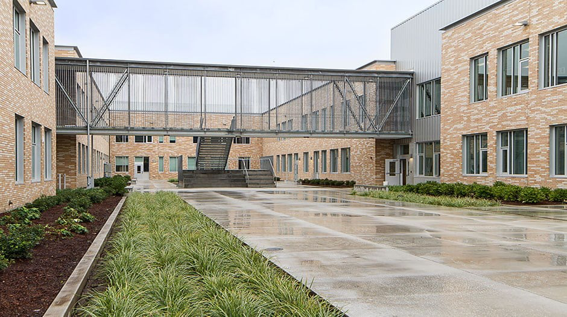

\pagenumbering{gobble}

\begin{centering}

\vspace{3cm}

```{r uni_logo, echo=F, out.width="90%"}

```

\vspace{1cm}


\Large

{\bf\color{blue} EFFICIENCY CHANGE IN ELEMENTARY SCHOOLS IN BEAVERTON SCHOOL DISTRICT}

\Large

{\bf\color{blue} (A MALMQUIST ANALYSIS)}

\vspace{0.5cm}


```{r BSD_logo, echo=F, out.width="90%"}

```


\vspace{1 cm}

\Large

{\bf\color{blue} PROJECT REPORT}


\vspace{1 cm}

\Large

{\bf\color{blue} By}

\vspace{0.1 cm}

\Large

{\bf\color{blue} Kamal Thapa}

\Large
{\bf\color{blue} Instructor: Dr. Timothy R. Anderson}


\Large
{\bf\color{blue} ETM 506: School District Benchmarking Using DEA}

\Large
{\bf\color{blue} Fall 2023}


\Large
{\bf\color{blue} Portland State University}

\end{centering}